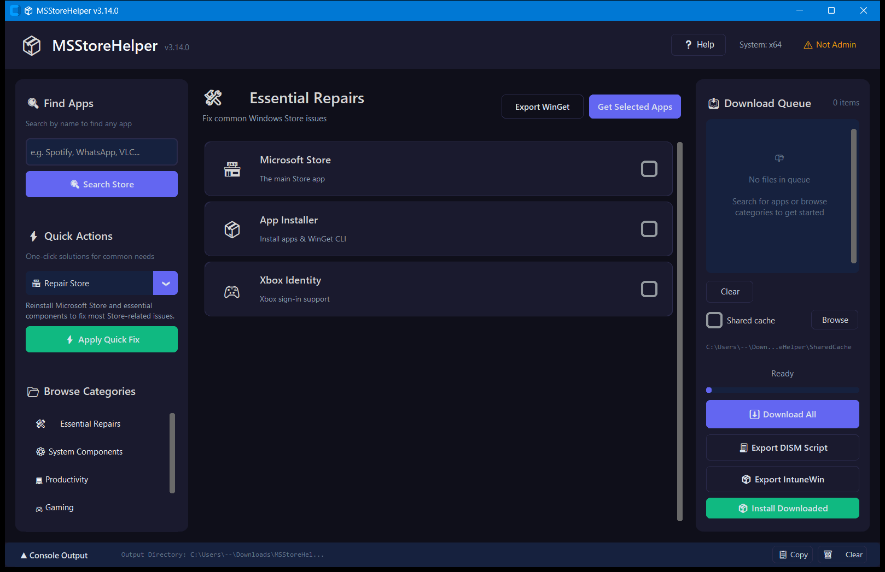

# 📦 MSStoreHelper

A GUI tool to download and install Microsoft Store apps **without needing the Microsoft Store**. Perfect for Windows LTSC editions, restricted environments, or when the Store just won't cooperate.


---



## ✨ Features

- 🔍 **Search the Microsoft Store** - Find any app by name using the official Microsoft API
- 📂 **Browse Categories** - Quick access to essential apps, gaming, productivity, dev tools & more
- ⚡ **Quick Fix Presets** - One-click solutions for common needs (Repair Store, Gaming Setup, Media Codecs)
- ✨ **Smart Select** - Automatically picks the best packages and dependency frameworks (bundles, correct architecture, newest versions)
- ⏭️ **Delta Detection** - Skips packages when the same or newer version is already installed
- 🧭 **Architecture Override** - Force x64, x86, ARM64, ARM, or neutral package selection when needed
- 🛡️ **Signature Verification** - Blocks installs unless the package signature chains to Microsoft
- 📥 **Download Queue** - Queue multiple packages with progress tracking
- 📦 **Install Packages** - Install downloaded apps directly (requires Admin)
- 🔧 **Store Repair** - Built-in repair preset for Store cache, TokenBroker, licensing, and connectivity issues
- 👥 **Provisioning Repair** - Clears Store deprovision tombstones and re-registers Store apps for new profiles
- 🔐 **Licensing Reset** - Restarts ClipSVC/LicenseManager and refreshes Store purchase licensing
- 🧹 **Cache Rebuild** - Scans, backs up, and recreates Store cache folders offline
- 🗂️ **Shared Offline Cache** - Mirrors downloaded AppX/MSIX artifacts to a shared folder for air-gapped reuse
- 🧾 **DISM Provisioning Export** - Generates fleet-ready PowerShell scripts that call DISM for queued packages
- 📋 **WinGet Import Export** - Saves selected Store apps as a reproducible WinGet `msstore` import manifest
- 📦 **IntuneWin Export** - Packages downloaded queue items with install and detection scripts for Intune Win32 apps
- 📋 **Verbose Console** - Detailed logging with error hints and troubleshooting tips

---

## 🖥️ Requirements

- **Windows 10/11** (including LTSC editions)
- **Python 3.8+**
- **Administrator rights** (for installation only)

Dependencies are auto-installed on first run:
- `customtkinter` - Modern UI framework
- `requests` - HTTP client
- `beautifulsoup4` - HTML parsing

---

## 🚀 Quick Start

### Option 1: Run Directly
```powershell
# Clone or download
git clone https://github.com/SysAdminDoc/MSStoreHelper.git
cd MSStoreHelper

# Run (dependencies auto-install)
python MSStoreHelper.py
```

### Option 2: Run as Admin (for installation features)
```powershell
# Right-click PowerShell → Run as Administrator
python MSStoreHelper.py
```

---

## 📖 How to Use

### 🔍 Finding Apps

1. **Search by Name**: Type an app name (e.g., "Spotify", "VLC", "Firefox") and click Search
2. **Browse Categories**: Click a category in the sidebar to see curated app lists
3. **Quick Actions**: Use presets for common tasks like repairing the Store or setting up gaming

### 📦 Downloading Packages

1. Click **"Get Files"** on any search result, or select multiple apps and click **"Get Selected Apps"**
2. Review the available packages (bundles, different architectures, versions)
3. Click **"✨ Smart Select"** to automatically pick the best files
4. Click **"➕ Add to Queue"** to add selected packages to the download queue
5. Optional: enable **Shared cache** and pick a shared folder for air-gapped reuse
6. Click **"⬇️ Download All"** to start downloading

### 🧾 Fleet Provisioning

1. Add the packages and dependencies you want to deploy to the download queue
2. Click **"🧾 Export DISM Script"**
3. Save the generated `.ps1` beside the downloaded packages or in your shared cache
4. Run the script from an elevated PowerShell session on the target PC

### 📦 Exporting an IntuneWin Package

1. Download the queued AppX/MSIX packages
2. Click **"📦 Export IntuneWin"**
3. Select `IntuneWinAppUtil.exe` if MSStoreHelper cannot find it automatically
4. Save the `.intunewin`; MSStoreHelper also writes a sidecar detection script

### 📋 Exporting a WinGet Manifest

1. Browse a category or search for apps
2. Select the apps you want to reproduce on other PCs
3. Click **"Export WinGet"**
4. Import the saved `.json` with `winget import -i <file>`

### 📦 Installing Packages

1. After downloading, click **"📦 Install Downloaded"**
2. **Note**: Requires Administrator privileges
3. Check the console output for any errors or hints

### 🔧 Repairing the Store

If you see errors like "The server stumbled" or "needs to be online":

1. Click **"🔧 Repair Store"** in the sidebar
2. Watch the console for cache, token, and licensing repair results
3. Restart your PC if the console recommends it

---

## 💡 Tips

| Tip | Description |
|-----|-------------|
| **Use Bundles** | Files ending in `.msixbundle` or `.appxbundle` work on all architectures |
| **Avoid Encrypted** | Skip `.eappx` and `.emsix` files - they won't install without a license |
| **Install Dependencies First** | Smart Select queues VCLibs, .NET Native, and UI.Xaml before main apps |
| **Check Windows Version** | Some apps require Windows 11 - check the console for compatibility errors |
| **Smart Select** | Let the tool pick the best packages automatically |

---

## ⚠️ Common Errors

| Error Code | Meaning | Solution |
|------------|---------|----------|
| `0x80073CFD` | App requires newer Windows | App incompatible - try older version |
| `0x80073D06` | Higher version installed | Treated as a no-op; you already have a newer version |
| `0x80073D02` | Package in use | Close the app and retry |
| `0x80073D19` | Missing dependency | Install VCLibs/.NET first |
| `0x80073CFF` | Sideloading disabled | Enable Developer Mode in Windows Settings |
| `0x80073CF3` | Already installed | App already exists |

---

## 🏗️ How It Works

MSStoreHelper uses two APIs:

1. **Microsoft Store Search API** (`storeedgefd.dsx.mp.microsoft.com`)
   - Same API used by WinGet and Intune
   - Returns app metadata and Package IDs

2. **RG-AdGuard Store API** (`store.rg-adguard.net`)
   - Provides direct download links for Store packages
   - Returns all available versions and architectures

Packages are downloaded to `%USERPROFILE%\Downloads\MSStoreHelper` and installed using PowerShell's `Add-AppxPackage` cmdlet.

---

## 📁 Project Structure

```
MSStoreHelper/
├── MSStoreHelper.py               # Main application
├── msstore_package_resolution.py  # Package selection and install ordering
├── tests/
│   ├── test_package_resolution.py # Resolver tests
│   ├── test_store_repair.py       # Store repair tests
│   ├── test_offline_cache.py      # Shared cache tests
│   ├── test_dism_export.py        # DISM export tests
│   ├── test_winget_export.py      # WinGet manifest tests
│   └── test_intune_export.py      # IntuneWin package tests
├── README.md                      # This file
├── LICENSE                        # MIT License
├── icon.png / icon.ico            # App icon assets
└── screenshot.png                 # README screenshot
```

---

## 🔧 Configuration

Default settings can be modified at the top of `MSStoreHelper.py`:

```python
APP_VERSION = "3.14.0"
DEFAULT_OUTPUT = os.path.join(os.environ['USERPROFILE'], "Downloads", "MSStoreHelper")
```

---

## 📋 App Catalog

The built-in catalog includes:

| Category | Apps |
|----------|------|
| 🛠️ Essential Repairs | Microsoft Store, App Installer, Xbox Identity |
| ⚙️ System Components | VC++ Runtime, HEVC Codec, AV1 Codec, WebP |
| 💻 Productivity | Windows Terminal, PowerToys, Notepad, Calculator, Snipping Tool, Photos |
| 🎮 Gaming | Xbox App, Xbox Game Bar, Gaming Services |
| 🌐 Browsers | Firefox, Brave |
| 🛠️ Developer Tools | VS Code, Python 3.12, PowerShell 7, WSL |

---

## 🤝 Contributing

Contributions are welcome! Please feel free to submit a Pull Request.

1. Fork the repository
2. Create your feature branch (`git checkout -b feature/AmazingFeature`)
3. Commit your changes (`git commit -m 'Add some AmazingFeature'`)
4. Push to the branch (`git push origin feature/AmazingFeature`)
5. Open a Pull Request

---

## 📄 License

This project is licensed under the MIT License - see the [LICENSE](LICENSE) file for details.

---

## 🙏 Acknowledgments

- [RG-AdGuard](https://store.rg-adguard.net/) - For providing the package download API
- [CustomTkinter](https://github.com/TomSchimansky/CustomTkinter) - For the modern UI framework
- Microsoft - For the Store search API

---

## ⚠️ Disclaimer

This tool is provided as-is for legitimate use cases such as:
- Installing apps on Windows LTSC editions
- Offline/restricted environments
- Troubleshooting Store issues

Always download apps from official sources. The author is not responsible for any misuse of this tool.

---

<p align="center">
  Made with ❤️ for the Windows LTSC community
</p>
